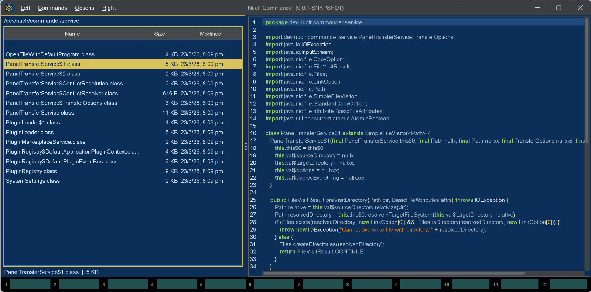

# 🔎 JVM Class Quick Viewer

Rich quick preview for Java `.class` files inside Nuclr, powered by **Vineflower** decompilation and a syntax-highlighted Swing viewer.

## ✨ Overview

The **JVM Class Quick Viewer** plugin adds instant previews for compiled Java class files in Nuclr. When a `.class` file is selected, the plugin decompiles it and renders readable Java source in a dedicated quick-view panel.

It is built for fast inspection workflows where opening a full decompiler or external IDE would be unnecessary.

## 🖼️ Screenshot



## 🚀 Features

- ⚡ Quick preview for `.class` files
- 🌿 Integrated **Vineflower** decompilation
- 🎨 Syntax-highlighted Java rendering with **RSyntaxTextArea**
- 🔢 Line numbers and code folding for easier navigation
- 🧭 Read-only panel designed for inspection, not editing
- 🌓 Theme-aware UI updates through Nuclr plugin events
- 🛡️ Graceful fallback messages when decompilation fails or produces no output

## 🧩 How It Works

When Nuclr asks the plugin to preview a file:

1. The provider checks whether the selected item has the `.class` extension.
2. The class bytes are copied to a temporary file.
3. Vineflower decompiles the class into Java source.
4. The result is displayed in a syntax-highlighted quick-view panel.
5. Theme updates from the host application are applied to the viewer automatically.

## 📦 Project Metadata

- **Plugin name:** `JVM Class Quick Viewer`
- **Plugin id:** `dev.nuclr.plugin.core.quickviewer.jvm`
- **Version:** `1.0.0`
- **License:** `Apache-2.0`
- **Website:** `https://nuclr.dev`

## 🛠️ Tech Stack

- ☕ Java 21
- 🧱 Maven
- 🌿 Vineflower `1.11.2`
- 🎨 RSyntaxTextArea `3.6.1`
- 🪶 Lombok
- 🧩 Nuclr Plugins SDK

## 📁 Repository Layout

```text
.
|-- images/
|   `-- screenshot-1.jpg
|-- src/
|   |-- assembly/
|   |   `-- plugin.xml
|   `-- main/
|       |-- java/dev/nuclr/plugin/core/quick/viewer/jvm/
|       |   |-- ClassQuickViewPanel.java
|       |   `-- ClassQuickViewProvider.java
|       `-- resources/
|           `-- plugin.json
|-- pom.xml
`-- README.md
```

## 🔧 Build

Build the plugin with Maven:

```bash
mvn clean package
```

This produces:

- `target/quick-view-jvm-1.0.0.jar`
- `target/quick-view-jvm-1.0.0.zip`
- runtime dependencies under `target/plugin/lib/`

## ✅ Verify

If signing is configured in your environment, you can run:

```bash
mvn verify
```

The `verify` phase also generates a detached signature for the packaged plugin ZIP.

## 🔌 Nuclr Integration

The plugin is registered as a Nuclr quick-view provider through `plugin.json` and exposes:

- support for files with the `class` extension
- a quick-view panel based on Swing
- dynamic theme application via Nuclr plugin events

## 🧪 Development Notes

- The viewer is intentionally **read-only**.
- Preview content is generated on demand from the selected class file.
- Temporary decompilation artifacts are cleaned up after each preview.
- If a preview is cancelled, the active request is marked accordingly before the next one starts.

## 📄 License

Licensed under the [Apache License 2.0](LICENSE).
