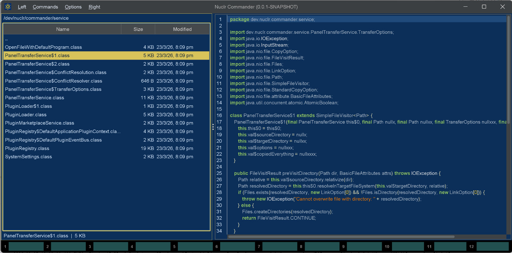

# 🔎 JVM Class Quick Viewer

Rich quick preview for Java `.class` files inside Nuclr Commander, powered by **Vineflower** decompilation and a syntax-highlighted Swing viewer.

## ✨ What It Does

When a `.class` file is selected, the plugin decompiles it and renders readable Java source in a dedicated quick-view panel — no need to open a full decompiler or IDE.

- ⚡ Instant quick preview for compiled `.class` files
- 🌿 Integrated **Vineflower** decompilation
- 🎨 Syntax-highlighted Java rendering with **RSyntaxTextArea**
- 🔢 Line numbers and code folding for easier navigation
- 🧭 Read-only panel designed for inspection, not editing
- 🌓 Theme-aware UI updates through Nuclr plugin events
- 🛡️ Graceful fallback messages when decompilation fails or produces no output
- ⛔ Cancellation-aware — switching files cancels the in-flight decompilation

## 🧩 Supported Formats

| Extension | Format |
|---|---|
| `.class` | Compiled Java bytecode |

## 🖼️ Screenshot



## 🧩 How It Works

1. The provider checks whether the selected item has the `.class` extension.
2. The class bytes are copied to a temporary file.
3. Vineflower decompiles the class into Java source.
4. The result is displayed in a syntax-highlighted, read-only RSyntaxTextArea panel.
5. Theme updates from Nuclr Commander are applied to the viewer automatically.
6. Temporary decompilation artifacts are cleaned up after each preview.

## 📥 Installation

Copy the signed plugin archive and detached signature into the Nuclr Commander `plugins/` directory:

```text
quick-view-jvm-<version>.zip
quick-view-jvm-<version>.zip.sig
```

Nuclr Commander verifies the RSA-SHA256 signature against `nuclr-cert.pem` on load. The plugin becomes available immediately without a restart.

## 🗂️ Source Layout

```text
src/main/java/dev/nuclr/plugin/core/quick/viewer/jvm/
├── ClassQuickViewProvider.java   plugin entry point
└── ClassQuickViewPanel.java      Swing panel, decompilation, syntax highlighting
```

## 📚 Dependencies

| Library | Version | Purpose |
|---|---|---|
| `dev.nuclr:platform-sdk` | `3.0.1` | Nuclr platform interfaces |
| `vineflower` | `1.11.2` | Java bytecode decompiler |
| `rsyntaxtextarea` | `3.6.1` | Syntax-highlighted text rendering |

## 📄 License

Licensed under the [Apache License 2.0](LICENSE).
